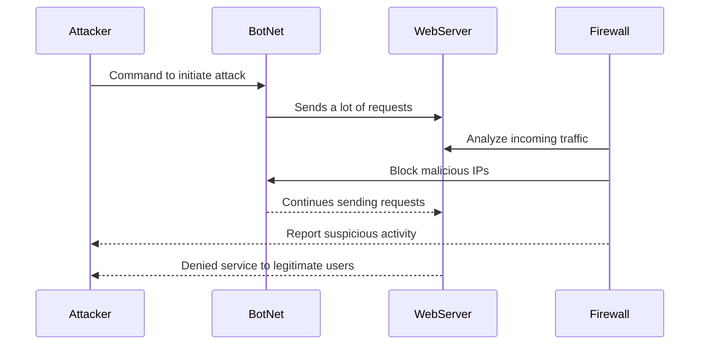

## Documentation

The attacker sends a command to the BotNet to start the attack. The BotNet sends a lot of requests to the WebServer. The Firewall of the server anaylzes these requests. In response, the firewall blocks malicious IPs associated with the BotNet. In this process, some legitimate users will be denied service because it is flooded with requests from the attack.