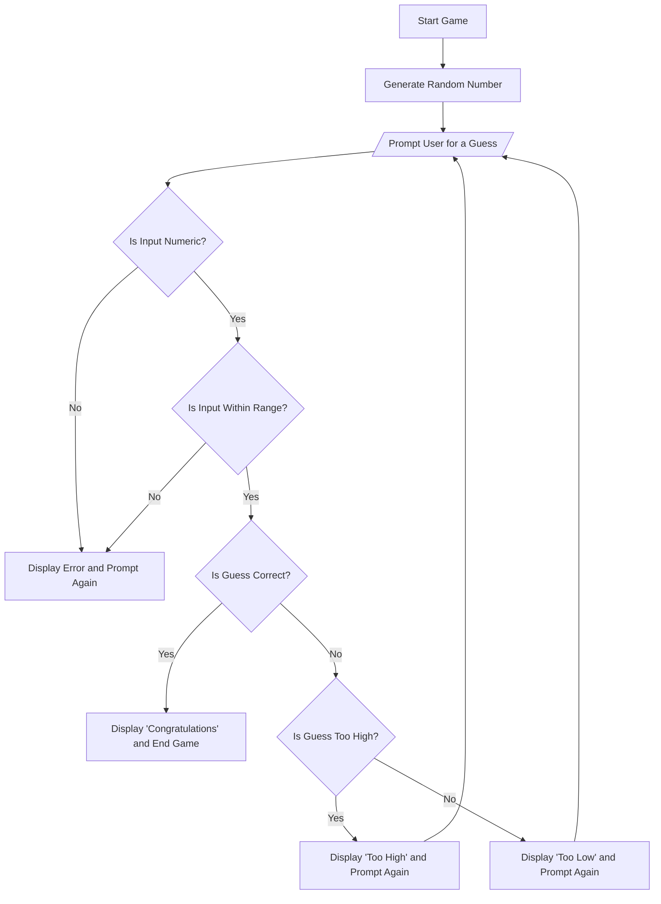

## Documentation
The game starts and the code generates a random number. The user is then prompted to guess a number. It checks the validity of the user input. Then, it checks if the guess is correct. If it is correct, the game ends and displays a congratulations page. If it is incorrect the code will say "too high" or "too low" and ask user for another guess. This process repeats until the user inputs the correct number.