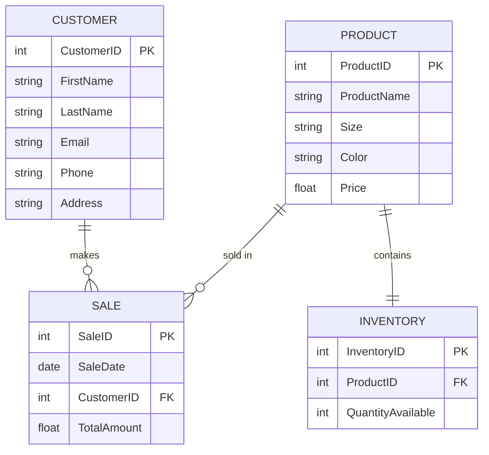

## Documentation
The "Product" entity represents the Nike shoes sold in the store. It has the PK of ProductID. The "Customer" entity holds the customer information. It has the PK of CustomerID. The "Sale" entity links the products sold to customers. It has the PK of SaleID and the Fk of CustomerID. The "Inventory" entity tracks the available stock of each product. It has the PK of InventoryID and Fk of ProductID.

Product to Sales - Allows the store to track which products are sold.
Customer to Sale - Allows the store to track what products the customers have bought. The store can then use this information to learn the preferences of their customers and make better sales.
Product to Inventory - Allows the store to manage stock levels.